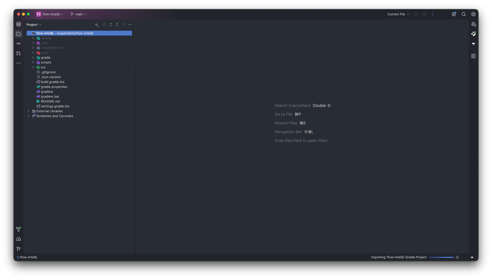

# Flow Icons for IntelliJ

An IntelliJ IDEA plugin that brings the beautiful [Flow Icons](https://flow-icons.pages.dev/) icon set to the IntelliJ platform.

Icons appear in the Project tree, editor tabs, and everywhere else files are displayed in the IDE.



> Icons by [thang-nm](https://github.com/thang-nm), ported to Zed by [Benjamin Halko](https://github.com/BenjaminHalko), packaged for IntelliJ by [Henrique Krauss](https://github.com/henriquekrauss).

---

## Features

- 500+ file type icons covering languages, frameworks, tools, and config files
- 900+ named folder icons (`.github`, `src`, `components`, `node_modules`, etc.)
- Compound extension matching (`foo.stories.tsx` → Storybook, `foo.test.ts` → test icon)
- Specific filename matching (`Cargo.toml`, `docker-compose.yml`, `.eslintrc`, etc.)
- Falls back to a generic Flow file/folder icon for unrecognized types

---

## Installation

### 1. Download icons

**Free (public icon set):**
```sh
./scripts/download-icons.sh
```

**Pro (requires a [Flow Icons license](https://github.com/BenjaminHalko/flow-icons-zed)):**
```sh
node scripts/download-icons-pro.mjs YOUR_LICENSE_KEY
# or
FLOW_ICONS_LICENSE=YOUR_LICENSE_KEY node scripts/download-icons-pro.mjs
```

Both scripts default to the `deep` dark theme. Pass a theme name as the last argument to use a different one:

| Theme | Appearance |
|---|---|
| `deep` *(default)* | Dark |
| `dim` | Dark (dimmed) |
| `dawn` | Dark (warm) |
| `deep-light` | Light |
| `dim-light` | Light (dimmed) |
| `dawn-light` | Light (warm) |

```sh
./scripts/download-icons.sh dim
node scripts/download-icons-pro.mjs YOUR_LICENSE_KEY dawn
```

### 2. Build the plugin

```sh
./gradlew buildPlugin
```

This produces `build/distributions/flow-intellij-1.0.0.zip`.

### 3. Install in IntelliJ IDEA

1. Open IntelliJ → **Settings** (`⌘,` on macOS)
2. Go to **Plugins**
3. Click the **⚙️** gear icon → **Install Plugin from Disk...**
4. Select `build/distributions/flow-intellij-1.0.0.zip`
5. Click **OK** → **Restart IDE**

---

## Development

### Requirements

- JDK 17+
- Node.js 18+ (only for the pro icon download script)
- `brotli` CLI (only for pro icons — `brew install brotli`)

### Project structure

```
flow-intellij/
├── scripts/
│   ├── download-icons.sh          # Downloads free icons from GitHub
│   └── download-icons-pro.mjs     # Downloads pro icons using a license key
├── src/main/
│   ├── kotlin/com/superlative/flowintellij/
│   │   ├── FlowIconProvider.kt    # FileIconProvider implementation
│   │   ├── FlowIconMappings.kt    # Extension & filename → icon name maps
│   │   └── FlowFolderMappings.kt  # Folder name → icon name map
│   └── resources/
│       ├── META-INF/plugin.xml
│       └── icons/flow/            # PNG icon files (git-ignored, populated by scripts)
├── build.gradle.kts
└── gradle.properties
```

### How icon resolution works

For files, the provider checks in this order:
1. **Full filename** (`cargo.toml` → cargo, `.eslintrc` → eslint)
2. **Compound suffix** — everything after the first dot (`foo.stories.tsx` → storybook)
3. **Simple extension** (`py` → python, `ts` → typescript)
4. **Fallback** → generic `file.png`

For folders, the folder name is matched against a map of 900+ named folder icons, falling back to `folder_gray.png`.

### Updating icon mappings

Mappings are generated from the Zed extension's `flow-icons.json`. If the upstream icon set adds new mappings, re-generate with:

```sh
# Fetch latest JSON and regenerate Kotlin mapping files
python3 -c "
import json, urllib.request

url = 'https://raw.githubusercontent.com/BenjaminHalko/flow-icons-zed/main/icon_themes/flow-icons.json'
data = json.loads(urllib.request.urlopen(url).read())
theme = data['themes'][0]

def to_kotlin_map(name, d):
    lines = [f'        \"{k.replace(chr(34), chr(92)+chr(34))}\" to \"{v}\"' for k, v in sorted(dict.fromkeys(k.lower(): v for k, v in d.items()).items())]
    return f'    val {name}: Map<String, String> = mapOf(\n' + ',\n'.join(lines) + '\n    )'
# ... (see scripts/ for the full generator)
"
```
